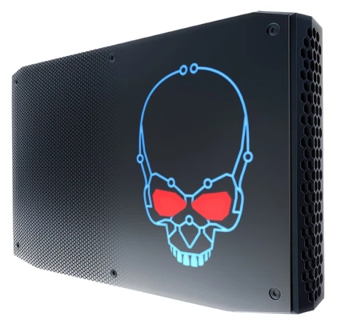
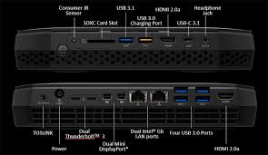
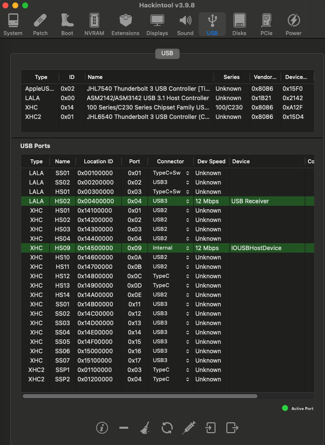
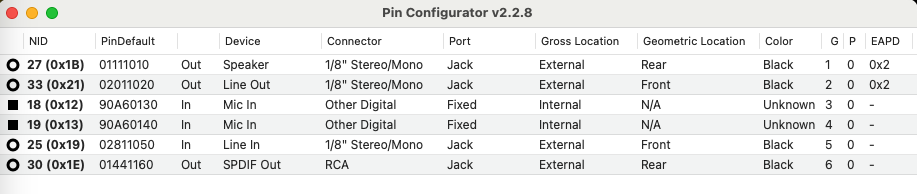
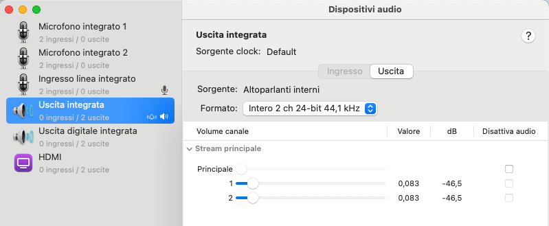
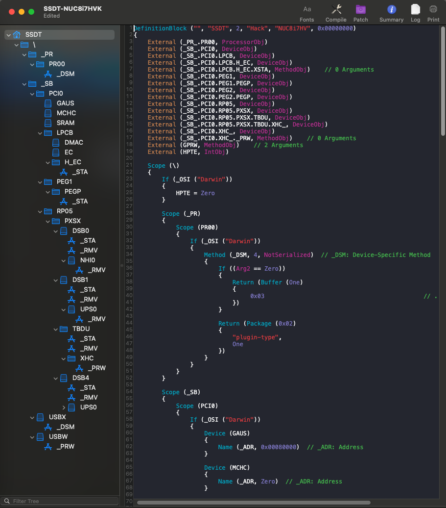
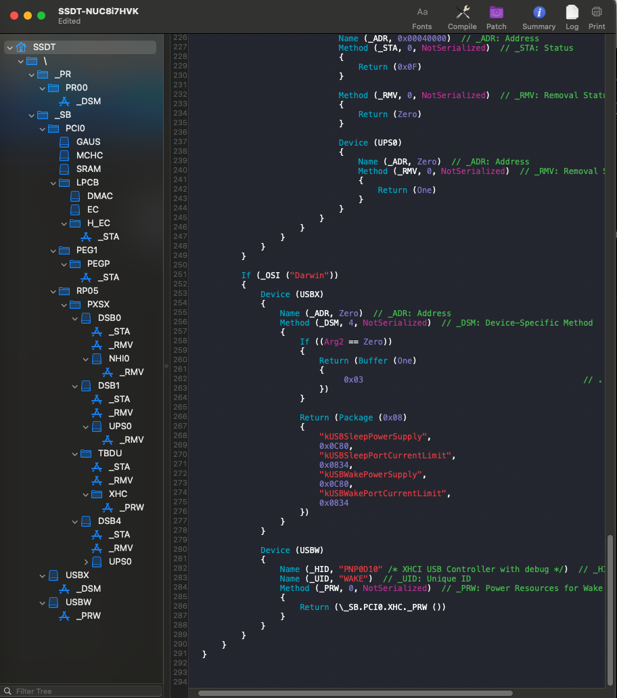
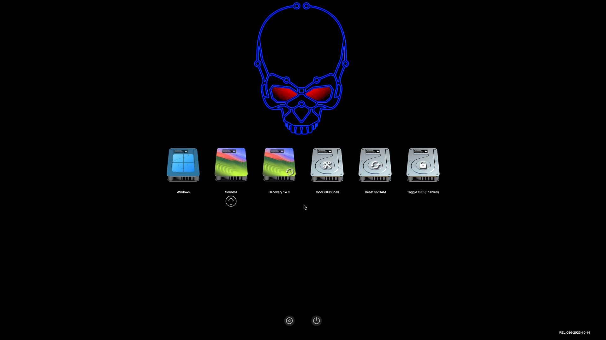

:it: 

# NUC8i7HVK-Hackintosh

 
## Specification:

- CPU: Intel® Core™ i7-8809G (Kaby Lake-r)
- Memory: 2x16GB DDR4-2400
- Harddrive: 1TB PCIe-NVMe M.2 SSD
- GPU: Intel HD 630 (Empty Framebuffer)
- Discrete GPU: Radeon™ RX Vega M GH Graphics 4GB
- WLAN: Intel dual-band 8265 Wireless 802.11ac (2 x 2) & Bluetooth 4.1
- Audio: Realtek HDA ALC700 7.1 Digital Audio, 3.5mm Front Headset Jack, 3.5mm Rear Speaker/TOSLINK Combo Jack
- 2x Thunderbolt 3 Type-C, 5x USB 3.0 Type-A, 1x USB 3.1 Gen 2 Type-A, 1x USB 3.1 Gen 2 Type-C, 2x LAN, 2x Mini DisplayPort, 2x HDMI 2.0b
- LAN: Intel Wired i210-AT and i219-LM
- SD Card Reader
- Headphone / mic combo 

## BIOS V 0070 (12/19/2022) Settings:

The bios must be properly configured prior to installing macOS.
In Security menu, set the following settings:

-  `Security > Security Chip`: must be **Disabled**
-  `Memory Protection > Execution Prevention`: must be **Enabled**
-  `Virtualization > Intel Virtualization Technology`: must be **Enabled**
-  `Virtualization > Intel VT-d Feature`: must be **Enabled**
-  `Anti-Theft > Computrace -> Current Setting`: must be **Disabled**
-  `Secure Boot > Secure Boot`: must be **Disabled**
-  `Intel SGX -> Intel SGX Control`: must be **Disabled**
    
## Working:

 - Audio (Fix ALL Sound - New Layout 22 for ALC700)
 - GPU acceleration
 - Intel Wireless / Bluetooth
 - Native CPU power management
 - SD card reader (Fix 3\12\2023 add CtlnaSDXC.kext + Spoof Device Properties)
 - HDMI video and sound 
 - Thunderbolt JHL6540 Alpine Ridge Work whit HotPlug 
   
## Not Work:
 
## USB Map:

## New Layout All Sound:

## SSDT Full Hack

## Gui Opencore

## Credits

- [Apple](https://apple.com) for macOS.
- [Acidanthera](https://github.com/acidanthera) for OpenCore and all the lovely hackintosh work.
- [Dortania](https://dortania.github.io/OpenCore-Install-Guide/config-laptop.plist/icelake.html) For great and detailed guides.
- [Hackintoshlifeit](https://github.com/Hackintoshlifeit) Support group for installation and post installation.
