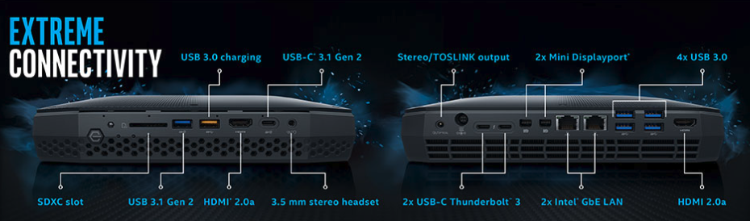
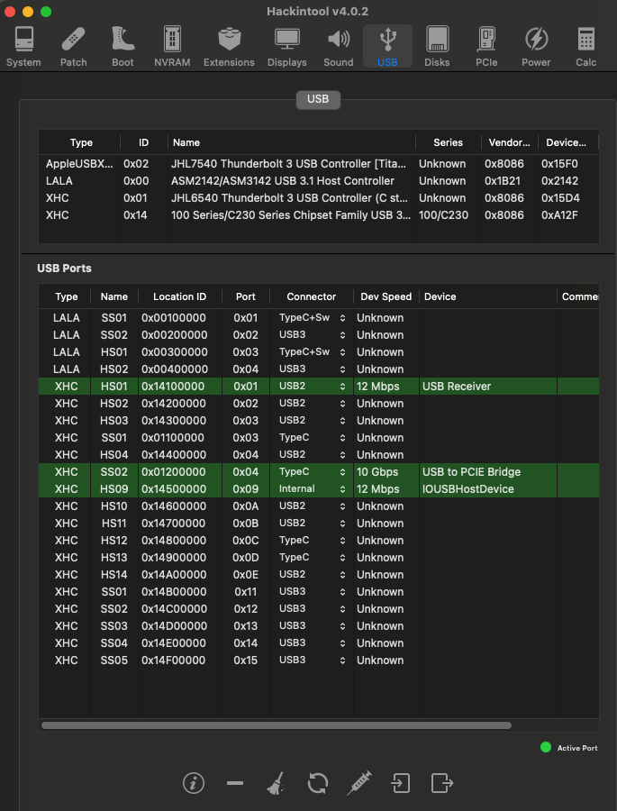

# NUC8i7HVK-Hackintosh

 
## Specification:

- CPU: Intel® Core™ i7-8809G (Kaby Lake-R)
- Memory: 2x16GB DDR4-2400
- Harddrive: 1TB PCIe-NVMe M.2 SSD
- GPU: Intel HD 630 (Empty Framebuffer)
- Discrete GPU: Radeon™ RX Vega M GH Graphics
- WLAN: Intel dual-band 8265 Wireless 802.11ac (2 x 2) & Bluetooth 4.1
- Audio: Realtek HDA ALC700
- 2x USB-C/Thunderbolt 3 Alpine Ridge (power delivery, DisplayPort, data transfer)
- SD Card Reader
- Headphone / mic combo 

## BIOS V 0070 (12/19/2022) Settings:

The bios must be properly configured prior to installing macOS.
In Security menu, set the following settings:

-  `Security > Security Chip`: must be **Disabled**
-  `Memory Protection > Execution Prevention`: must be **Enabled**
-  `Virtualization > Intel Virtualization Technology`: must be **Enabled**
-  `Virtualization > Intel VT-d Feature`: must be **Enabled**
-  `Anti-Theft > Computrace -> Current Setting`: must be **Disabled**
-  `Secure Boot > Secure Boot`: must be **Disabled**
-  `Intel SGX -> Intel SGX Control`: must be **Disabled**
-  `Device Guard`: must be **Disabled**

In Startup menu, set the following options:

-  `UEFI/Legacy Boot`: **UEFI Only**
-  `CSM Support`: **No**

In Thunderbolt menu, set the following options:

-  `Thunderbolt BIOS Assist Mode`: **UEFI Only**
-  `Wake by Thunderbolt(TM) 3`: **No**
-  `Security Level`: **No**
-  `Support in Pre Boot Environment > Thunderbolt(TM) device`: **No**

In Display menu, set the following options:
         
-  `Boot Display Device` : **LCD**
-  `Shared Display Priority` **HDMI**
-  `Total Garphics Memory` : **512MB** If you set it like this in Bios you can delete "framebuffer-fbmem | Data | 00009000" in patch IGPU.
-  `Boot Time Extension` : **Disabled**	   
   
## Working:

 - Audio (Internal)
 - GPU acceleration
 - Intel Wireless / Bluetooth
 - Native CPU power management
 - SD card reader
 - HDMI video and audio 
 - Thunderbolt JHL6540 Alpine Ridge Work whit HotPlug 
   
## Not Work:
 
## USB Map:

## Credits

- [Apple](https://apple.com) for macOS.
- [Acidanthera](https://github.com/acidanthera) for OpenCore and all the lovely hackintosh work.
- [Dortania](https://dortania.github.io/OpenCore-Install-Guide/config-laptop.plist/icelake.html) For great and detailed guides.
- [Hackintoshlifeit](https://github.com/Hackintoshlifeit) Support group for installation and post installation.
